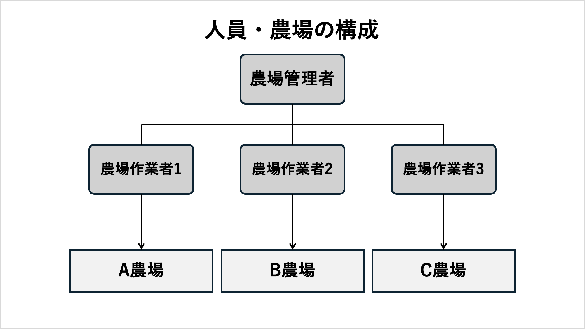
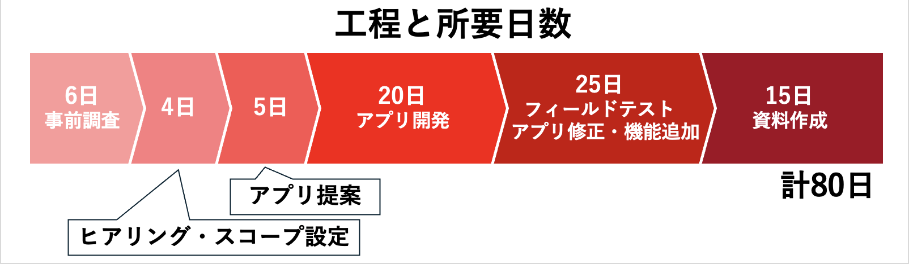
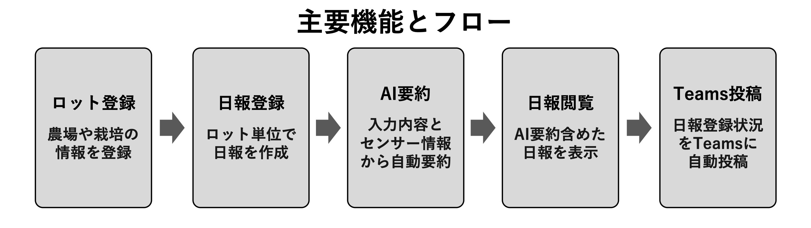
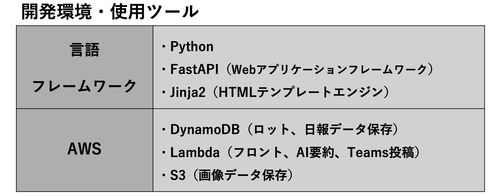
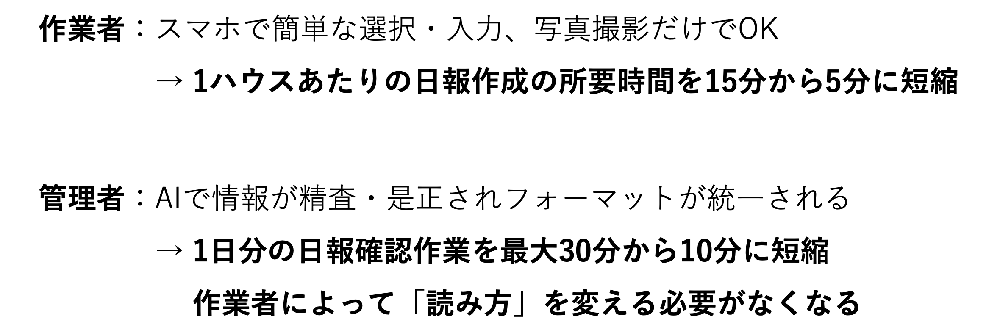
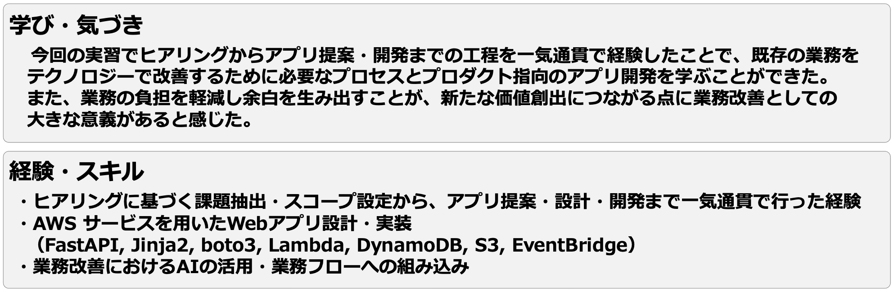

# 日報要約自動作成アプリ（おまかせ日報コンシェルジュ）

長期企業内実習内で開発したアプリの簡易デモ版です。

ローカル環境構築手順

1. 以下コマンドでクローン 
    git clone https://github.com/Toya-Itoga/app_demo.git

2. 以下コマンドでクローンしたフォルダに移動 
    cd <クローンしたフォルダ名>

3. 以下コマンドで仮想環境を作成 
    python3 -m venv .venv

4. 以下コマンドで仮想環境をアクティブ化 
    source .venv/bin/activate

5. 以下コマンドでライブラリをインストール 
    pip install -r requirements.txt

6. 以下コマンドでuvicornを起動 
    uvicorn main:app --reload

7. http://localhost:8000 にアクセス

# 背景・実習概要
私の大学では長期の企業内実習がカリキュラムに組み込まれています。私はIT企業ながら自社で農場を運営している企業で農場業務改善PoCをテーマに約4ヶ月間、実習を行いました。人員と農場の構成は以下の図の通りです。

実習ではヒアリングによる課題定義から、アプリの提案・開発、フィードバックに基づいた修正・改善までの工程を一気通貫で行いました。工程と所要日数は以下の図の通りです。

## 🚜1. ヒアリング
- 対象者：農場管理者
- 目的：業務改善の出発点となる情報を収集し、問題定義の糸口を作る
- 方法(進め方)： 
    1.全体を聞く → 現場の業務状況など全体を把握 
    2.情報を整理 → 情報を分類・関連付け 
    3.ポイントを絞る → 改善の可能性が高い部分を具体的にヒアリング 
    4.情報を再整理 → 結果を整理し問題を定義

## 🎯2. スコープ設定
- 2つの問題点から、日報作成業務をスコープとして設定しました
- 前提： 
    ・日報はTeamsで管理している 
    ・作業者が日報を作成し、管理者が日報を確認して栽培の状況や発生している問題等を把握している
- 問題点： 
    1.ホワイトボード記入 → 写真撮影 → Teams投稿とステップが多いため、日報の作成に時間がかかる 
    2.作業者の経験・感覚・主観によって、日報の質・内容が異なるため、管理者が日報の内容と実際の状況にズレがないか毎回確認する必要がある

## 💡3. アプリ提案
- 2つの問題点を踏まえ、AIによる日報要約自動作成アプリを提案しました
- アプリ概要：作業者の入力とセンサー情報を基にAIが日報要約を自動作成
- 主要機能とアプリ利用フローは以下の図の通りです（デモ版では一部機能を省略しています）

## 🛠4. アプリ開発
- 短期間で開発・検証できる構成を選定しました
- Webアプリケーションとしてアプリを構築し、AWSで動作
- 本番環境の技術スタックは以下の表の通りです（デモ版では一部を変更しています）

## 🔄5. アプリ修正・機能追加
- 実習ではアプリを開発するだけでなく、改善要望やフィードバックをもとにしたアプリ修正・機能追加まで実施しました
- 目的： 
・実際の作業現場でアプリが問題なく利用できるか検証する 
・作業者から使い勝手や改善点のフィードバックを得て、アプリの修正・機能追加につなげる
- 方法(進め方)： 
    1.農場作業者にアプリの機能や使い方を説明する 
    2.通常作業の中で実際にアプリを使用してもらう 
    3.使用中に出てきた改善要望やフィードバックを基にアプリ修正・機能追加

<!-- # アプリ詳細
## システム構成図(本番環境) -->

# アプリ導入効果
- アプリを導入することによって管理者・作業者双方に負担軽減効果が得られました

# 得られた学び、経験・スキル
